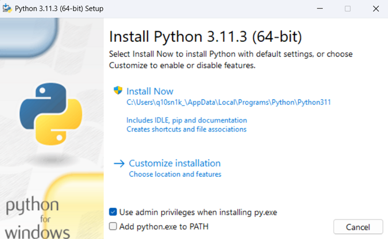

# Скачайте инсталлятор Python
https://www.python.org/downloads/
# Во время установки поставьте селектор - 'ADD Python.exe to PATH'

# В VS Code утановите плагин Jupyter

# Создайте директорию проекта
откройте терминал в VS Code следующей командой
```
ctrl + ~
```
# Создайте виртуальное окружение python следующей командой
```
python -m venv venv
```
# в VS Code следующим сочетанием клавиш создайте файл `.ipynb`
```
ctrl + shift + alt + n
```
# Выберете любой Default language
далее выберете .Net Interactive


кликните на .Net Interactive и выберете Python venv.

# После первого запуска кода из 1-й ячейки нажмите в нижнем правом углу
```
Install ipykernel
```